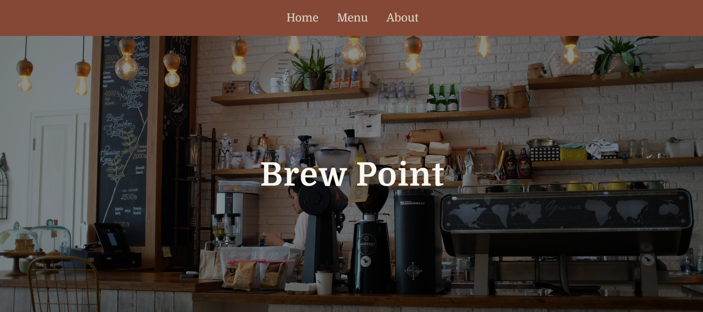

# Brew  Point

A mock website built for my web programming class.

## Description
The website is fully built with HTML and CSS (no JS). The Brew Caffee is a made up caffee and is made in purpose of the assignment. It's main inspirations are Starbucks and the Funiculi Funicula caffe from the popular book series "Before the coffee gets cold". The minimal design of the website goes with the caffes personal goals: simple, quiet and aesthetic. While it's small and ernest there is more then one location. It's primary location is in Detroit with side locations in Grand Rapids and Pittsburgh. In the future it has plans for going down South and bringing delicious coffe cups to the rest of America. The jump to Europe and other continents is still undecided and will be for the time being.